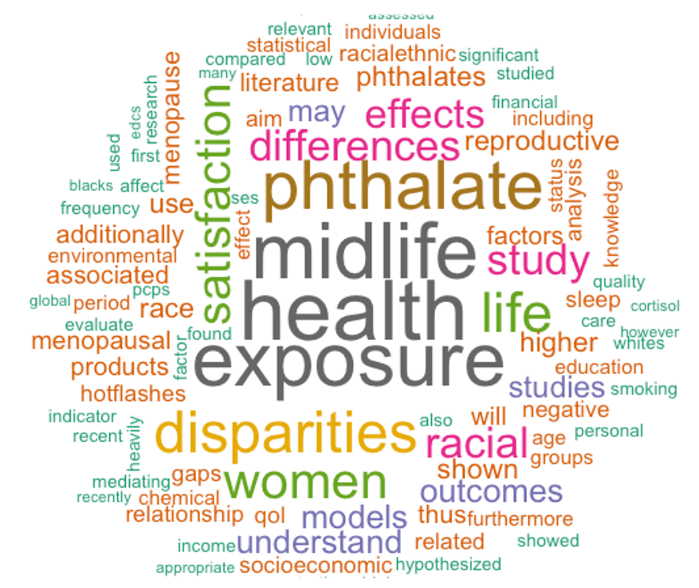

### Healthy Environment and Endocrine Disruptor Strategies (HEEDS) Young EDC Scientists Showcase (YESS)
#### November 2020

The [YESS webinar series](https://www.healthandenvironment.org/our-work/webinars/heeds-young-edc-scientists-showcase-(yess)) features speakers who are in early career stages and who study endocrine disrupting chemicals or EDCs. I was invited to speak for the series topic on *Racial/Ethnic Differences in EDC Exposures*. My topic was on the *Effects of Phthalate Exposure and Health Dispairities on Reproductive Health*. The talk can be accessed [here](https://www.youtube.com/watch?v=KEb64xjsQUk&feature=emb_logo).

{width=40%}

### MCIS Lunch and Learn Series at Mississippi Valley State University (MVSU)
#### September 2018

This event allows MVSU alumni of the [Mathematics, Computer, and Information Science Department](http://mcis.mvsu.edu) to return to the university and share their post-bac experiences with current apsiring undergraduate students.

{width=30%}{width=30%}{width=30%}{width=30%}
